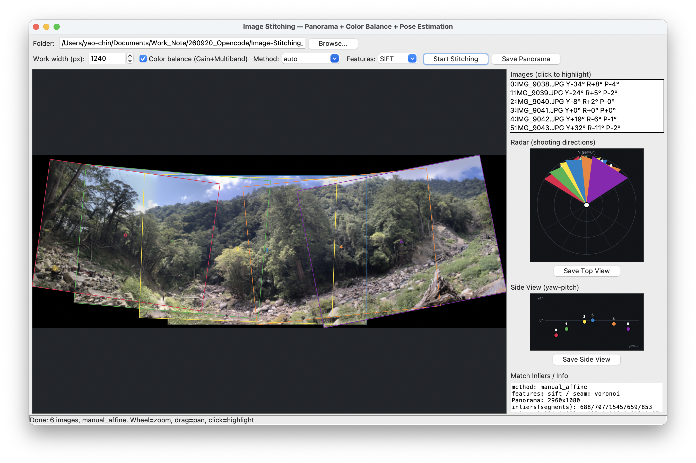
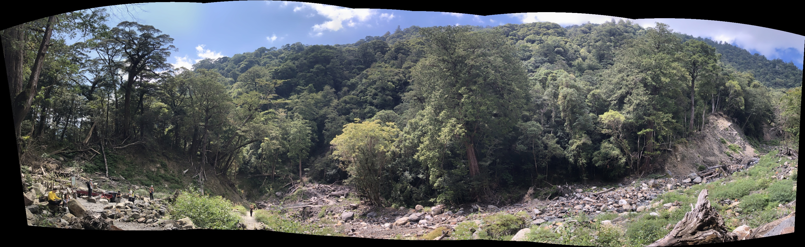

# Image-Stitching_Proj

原地旋轉拍攝的多張照片 → 全景拼接 ＋ 色彩/曝光平衡 ＋ 拍照位置逆推（雷達俯視圖），
並以可互動的 Tkinter GUI 呈現。



## 拼接成果



`Result/` 另有手刻鏈全景（`Full_View.jpeg`）與雷達俯視圖存檔（`Bird-view.png`）。

## 演算法

**特徵＋匹配（手刻鏈）**

- 特徵點：`cv2.SIFT_create()`，實測每張約 7000~8000 個關鍵點；
  或切換 `ORB`（Oriented FAST and Rotated BRIEF），快數倍，適合快速預覽
- 匹配：BFMatcher＋`knnMatch(k=2)`＋Lowe ratio 0.75（ORB 用 Hamming 距離）

**幾何變換（兩段式）**

- 優先 `findHomography`＋RANSAC（8 自由度含透視）
- 發散時轉 `estimateAffinePartial2D`＋RANSAC（4 自由度：旋轉＋等比縮放＋平移）

**姿態逆推（yaw／roll／pitch）**

- yaw：多邊形中心水平位移近似；roll：H 面內旋轉分量直讀；
  pitch：垂直位移代理量（皆未標定，近似值）。GUI 另有 yaw-pitch 側視圖

**色彩＋融合**

- ON：`GainCompensator`＋中線縫＋`MultiBandBlender`
- OFF：重疊區算術平均（對照用）
- 縫線：重疊區每像素只取一張圖（最近 mask 質心者），消除錯位重影；
  自行實作（`stitcher._find_seams`，聯集守恆），`--seam none` 可關閉對照

## 環境安裝

```bash
conda activate opencv_evk
pip install -r requirements.txt
```

需求：`opencv-contrib-python>=4.8.0`、`numpy>=1.24.0`、`Pillow>=10.0.0`

## 使用方式

### GUI 模式

```bash
python main.py                    # 預設讀取 ./Pic
python main.py --folder ./Pic --width 1240
```

> `Pic/` 原始照片不上傳 GitHub，請自備有 5%~30% 重疊的連拍照片放入 `Pic/` 再執行。

### CLI 模式

```bash
python main.py --cli --save pano.jpg
python main.py --cli --method stitcher --save pano_st.jpg
```

| 參數 | 說明 |
|---|---|
| `--width` | 工作寬度 px（預設 1240）：先等比縮圖再拼接，越大越細但越慢 |
| `--method` | `auto`（手刻優先、失敗轉 Stitcher）／`manual`／`stitcher` |
| `--feature` | 手刻鏈特徵器：`sift`（預設，精確）／`orb`（快速預覽） |
| `--seam` | 重疊縫線：`voronoi`（預設，中線縫）／`none`（關閉對照） |
| `--gain-blocks` | 分塊增益（抗圖內亮度梯度；本組效果有限，預設關） |
| `--no-balance` | 關閉色彩平衡，改簡單平均（接縫對照用） |
